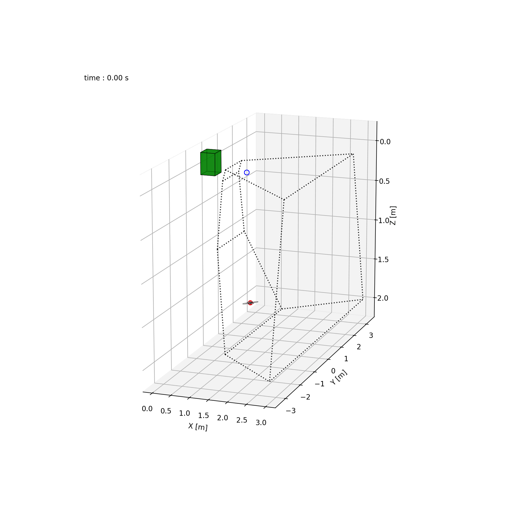

# Drone Interception

Reinforcement Learning-Based Guidance and Control for Aerial-to-Aerial Pest Interception

## Abstract

PATS-X is a greenhouse pest suppression system that uses a depth camera with an autonomous micro air vehicle (MAV) to detect, track, and physically intercept flying insects. This study targets guidance and control for reliable aerial-to-aerial interception. Reinforcement learning (RL) is used to learn policies from insect flight recordings. We evaluate control policies at increasing levels of abstraction: direct motor commands, collective thrust and body rates (CTBR), and acceleration. In simulation, lower abstraction levels yield better interception performance; moving from acceleration to motor command reduces the median time to first interception by about 41\%. A systematic variation of the observation space reveals that the most effective observations are body frame relative position and velocity, and short temporal histories add no benefit beyond noise filtering. Compared with a state-of-the-art classical benchmark, Fast Response Proportional Navigation (FRPN), the best motor level RL policy in simulation achieves a median first interception time of 0.85 [0.76--1.07]s with 99.1% interception rate, compared with FRPN at 1.90 [1.04--2.80]s and 95.6%. To address the reality gap, we compare how well the different control abstractions transfer to hardware. CTBR policies deploy on hardware with the least performance loss relative to simulation. Motor-level policies also transfer when trained with modest domain randomization (DR) plus an action-difference penalty that limits command jitter and thermal load. Acceleration-level policies did not transfer. In a PATS-X proof of concept, an RL controller deployed on the actual system reached a 95.6% interception rate of virtual moths versus 80.0% for the existing controller. Moreover, the RL controller shortened time-to-first-interception by 0.70s, indicating the potential of RL-based guidance for the PATS-X system.

## Overview

This repository contains the codebase for a reinforcement learning-based drone-pest interception controller. The codebase supports simulation training and a pipe-line for real-world deployment.

## Repository Structure

```
Drone_Interception/
├── src/                    # Core simulation and models
│   ├── models/             # Drone and pest/evaders
│   ├── simulation/         # Simulation environment (RL training & evaluation)
│   ├── control_laws/       # Control law interface
│   └── utils/              # Configuration, logging, utilities
├── scripts/
│   ├── training/           # Training scripts
│   ├── analysis/           # Analysis and evaluation tools
│   └── system_identification/  # System ID tool
└── deployment/             # Real-world deployment code
    ├── ivy_senders/        # Stream evader trajectories to Paparazzi (Ivy)
    └── extract_validate.py # Model extraction and validation
```

**Note**: Training datasets and trained models are not included in the repository but may be available upon request.

## Key Components

### Core Simulation (`src/`)

- **Models**: 
  - **Pursuers**: Motor-level, CTBR-INDI, and Acceleration-level controllers
  - **Evaders**: Moth trajectories, Pliska trajectories, reactive RL evaders, and classic evaders (see [`src/models/evaders/README.md`](src/models/evaders/README.md) for CSV format requirements)
- **Simulation**: 
  - **RL Training Environment**: Vectorized Gymnasium environment for training (see [`src/simulation/README.md`](src/simulation/README.md))
  - **Evaluation Simulation**: Standalone simulation for independent model evaluation
- **Control Laws**: API for control laws
- **Utils**: Configuration management, observation builders, reward functions, logging (see [`src/utils/README.md`](src/utils/README.md) for detailed config parameter documentation)

### Training (`scripts/training/`)

The training module provides tools for training reinforcement learning agents using PPO (Proximal Policy Optimization). See [`scripts/training/README.md`](scripts/training/README.md) for detailed documentation.


### Analysis (`scripts/analysis/`)

Analysis tools for evaluating trained models comparing different configurations in simulation, and processing physical drone flights (CyberZoo/PATS). See [`scripts/analysis/README.md`](scripts/analysis/README.md) for detailed documentation.

### Deployment (`deployment/`)

Methology for deploying trained models on physical drones and scripts for streaming target infornmation to paparazzi. See [`deployment/README.md`](deployment/README.md) for detailed documentation.

### System Identification (`scripts/system_identification/`)

Tools for identifying drone model parameters from paparazzi flight logs.

## Quick Start

### Installation

To ensure compatibility, use python 3.10. Nessecary for compatibility with Stable-Baselines3 2.X and TensorFlow 1.x

```bash
pip install -r requirements.txt
```

### Basic Usage

#### Run a Simulation

```bash
python scripts/main.py
```

This runs a single simulation using the configuration in `src/utils/config.py`, yielding an animation of the drone-pest pursuit. 

#### Train a Model

To train a single drone controller against an evader using the configuration in `src/utils/config.py`

Example:
```bash
python scripts/training/single_env.py
```

## Configuration

The configuration file is `src/utils/config.py`. See [`src/utils/README.md`](src/utils/README.md) for detailed documentation of all configuration parameters.


## Datasets

Training datasets used in this work may be available upon request. For information on creating compatible evader trajectory datasets, see [`src/models/evaders/README.md`](src/models/evaders/README.md).

## Animation


